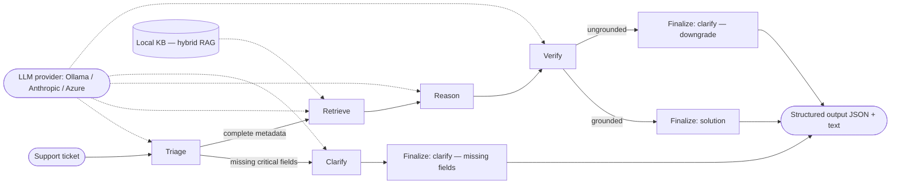

# agentic-ai-challenge

An agentic AI ticket-triage system: processes technical support tickets, retrieves grounding from a local knowledge base (hybrid RAG), decides whether to propose a solution or ask follow-up questions, and emits a structured, explainable result with confidence and a reasoning trace.

> Submission for the **WSCAD Code Challenge** (AI Technology Lead, take-home assignment). Repository: [github.com/cofade/agentic-ai-challenge](https://github.com/cofade/agentic-ai-challenge); build plan on [project board #2](https://github.com/users/cofade/projects/2).

## 30-second mental model

**In:** one support ticket — free text plus optional, possibly incomplete metadata.

**Out:** structured JSON + human-readable text containing category + priority, a proposed solution **or** 2–4 follow-up questions, a 0–1 confidence score, and a step-by-step reasoning trace citing the KB chunks the system relied on.

**How:** a supervisor + workers graph in LangGraph. A *triage* worker classifies and detects missing critical fields; if any are missing, a *clarify* worker generates targeted questions and the pipeline stops there. Otherwise a *retrieve → reason → verify* chain runs: hybrid RAG (BM25 + multilingual embeddings + Reciprocal Rank Fusion) pulls grounding from a local Markdown KB, the reason worker drafts a solution with per-claim citations, and a *verifier* LLM-as-judge scores per-claim groundedness — if the aggregate falls below threshold, the supervisor downgrades to clarify rather than shipping a confidently-wrong response.



The deeper view — the committed-to-source LangGraph state diagram, the building-block view, runtime sequences, and architectural decisions — lives under [**Deeper architecture documentation**](#deeper-architecture-documentation) below.

## Try it interactively — the primary reviewer surface

The fastest way to experience the system is the **chat REPL**: paste a ticket (free text or, for the cleanest demo, a Ticket JSON with complete metadata), see a compact agent response, answer the follow-up questions in-place, and watch the pipeline re-converge until you get a solution. Every turn re-runs the full agentic graph against your configured LLM and saves three artefacts (`<id>.json`, `<id>.txt`, `<id>.chat.md`) to `out/` so the conversation is auditable on disk.

```bash
# After the one-time setup (see Quickstart below)
uv run wscad-triage chat
```

**Solve on the first turn (best case).** Describe the issue in prose — the chat extracts metadata hints (OS / version / product) before triage runs, so a well-described ticket can go straight through retrieval and reasoning to a solution. Anchor the version with a `version` / `ver` / `v` label so the regex matches:

```text
WSCAD ticket-triage chat. Type /help for commands; /quit to exit.
Each turn re-runs the full agentic pipeline against your configured LLM.

Describe your issue (paste JSON or free text; submit with a blank line):
> Application fails to start after update. Error 504 appears.
... Using WSCAD Suite version 2.3 on Windows 11.
...
[Agent] Category: Licensing  |  Priority: High  |  Confidence: 1.00
Proposed solution:
Re-activate the offline license via the License Manager. Error 504 indicates
a licensing validation failure after an update; verify that the license
matches version 2.3 and that Windows 11 is fully updated.
> /quit
[chat] Goodbye.
```

The full chain (triage → retrieve → reason → verify → solve) depends on the LLM's tool-use fidelity. With `gpt-oss:20b` (offline default) the reason agent occasionally emits a draft with zero grounded claims; when that happens the verifier scores it 0 and the supervisor downgrades to clarify-with-no-solution. A stronger model (cloud Claude / `gpt-oss:120b`) reliably produces the full solve. The architecture is one ``--provider anthropic`` flag away from that path. See [`docs/baseline-outputs/`](docs/baseline-outputs/) for the actual offline artefacts.

Pasting a `Ticket` JSON works too if you prefer the structured shape (handy when pasting from a ticketing system export). The first non-`/` line that starts with `{` or `[` is parsed as JSON; anything else is treated as prose.

**Clarify → answer → solve.** A ticket whose root cause cannot be pinned down without more context. The agent identifies the gap, your reply is folded into the ticket, and the pipeline re-runs:

```text
> License stopped working on an offline machine. WSCAD Suite.
...
[Agent] Category: Licensing  |  Priority: High  |  Confidence: 0.25
Status: Insufficient information to determine root cause with acceptable confidence.
Preliminary assessment: The license stopped working on an offline machine.
Awaiting clarification on: version, os.

Please answer one or more of:
  1. What version of WSCAD Suite are you running on the offline machine?
  2. Which operating system (including version) is on the offline machine?

> version 7.4.0.17, Windows 11
[Agent] Category: Licensing  |  Priority: High  |  Confidence: 0.78
Proposed solution:
Re-activate the offline license via the License Manager …

> /details      # reprint the full reasoning trace + cited sources for the last turn
> /quit
```

**Free-text path.** Prose works too. The chat extracts OS / version / product hints from your description and from your follow-up answers, so a user typing *"Error 504 on Windows 11, version 7.4.0.17, WSCAD Suite"* gets the same metadata-populated triage as a JSON paste. The extractor is conservative — it only fills fields that are currently empty and only matches well-anchored patterns (`Windows 11`, `version 7.4.0.17`, known product names) — so an ambiguous description still routes to clarify and never invents data. See [ADR-011](docs/09-architecture-decisions/ADR-011-interactive-chat-cli.md) for the design.

**Slash commands**

| Command          | What it does |
|------------------|--------------|
| `/help`          | Show the command list. |
| `/details`       | Reprint the last turn in full (reasoning trace + cited sources). |
| `/reset`         | Clear the current ticket and start fresh without leaving the REPL. |
| `/quit`, `/exit` | End the session. EOF (Ctrl-D / Ctrl-Z) works too. |

Anything that does not start with `/` is folded into the current ticket — as the answer to the agent's pending follow-up questions if there are any, otherwise as additional context — and the pipeline re-runs.

**Notes for reviewers.** The chat keeps running after a solve so you can ask follow-up "what if" questions. There is no auto-exit; only you decide when the session ends. A friendly warning fires around turn 8 if a session runs long; it never force-quits. The chat surface complements (does not replace) the batch CLI documented under [Batch processing](#batch-processing) — both call the same `pipeline.run` entry point. See [ADR-011](docs/09-architecture-decisions/ADR-011-interactive-chat-cli.md) for the design rationale and the documented free-text limitation above.

## Status

| Phase | What it delivers | State |
|-------|------------------|-------|
| 0 | Bootstrap (context, quality gates, docs, CI, review workflow, entropy management) | Done |
| 1 | Pydantic schemas + KB foundation (loader, chunker, BM25, embeddings, hybrid retriever) | Done |
| 2 | KB extension (ELECTRIX AI release notes — see [risks doc](docs/11-risks-and-technical-debt/README.md)) | Done |
| 3 | LLM abstraction + supervisor and worker agents in LangGraph | Done |
| 4 | Confidence aggregation, output renderers, CLI | Done |
| 5 | Hand-labeled eval set + metrics harness | Done |
| 6 | Reviewer-facing README, arc42 fill-in, ADR cross-refs | Done |
| 7 | Senior-reviewer pass + senior-reviewer archive (#39 / #63 closed); CI verify, reviewer-clone smoke, submission link still open | Partly done |
| 8 | Interactive chat CLI (primary reviewer surface, ADR-011) | In progress |

## Quickstart

```bash
# Clone the repo and create a project-local venv
git clone https://github.com/cofade/agentic-ai-challenge.git
cd agentic-ai-challenge
python -m venv .venv
.\.venv\Scripts\python -m pip install uv     # PowerShell on Windows
# or:  ./.venv/bin/python -m pip install uv  # bash on macOS/Linux

# Copy the env template (defaults to Ollama; no API key required)
cp .env.example .env

# Sync dependencies and install pre-commit hooks
uv sync --all-extras
uv run pre-commit install

# Run the gates
uv run pytest tests/ -v --cov=src/wscad_triage
uv run ruff check src/ tests/ eval/
uv run mypy src/
uv run bandit -r src/ --severity-level high

# Open the interactive chat (primary surface — see "Try it interactively" above)
uv run wscad-triage chat
```

### Batch processing

For an unattended run over a JSON file of tickets — the format that ships in [`tickets/tickets.json`](tickets/tickets.json) — use the `batch` subcommand:

```bash
uv run wscad-triage batch tickets/tickets.json --out out/
# Or, equivalently (the legacy positional form is preserved):
uv run wscad-triage tickets/tickets.json --out out/
```

Both subcommands share the same flags: `--out DIR` (default `out/`), `--kb-dir DIR` (default `kb/`), and `--provider {ollama,anthropic,azure}` (overrides `WSCAD_TRIAGE_PROVIDER`).

The labeled eval set at [`tickets/eval_set.json`](tickets/eval_set.json) uses the richer `EvalTicket` shape (extra fields: `expected_category`, `should_clarify`, `coverage_case`, ...) and is read by the eval harness — run it with `uv run python -m eval.runner` (see [Baseline metrics](#baseline-metrics)). Passing the eval set to the CLI raises a Pydantic `extra_forbidden` error by design — the strict-schema boundary is what keeps the two entrypoints honest.

## Configuration

LLM calls go through a provider-agnostic interface ([ADR-004](docs/09-architecture-decisions/ADR-004-llm-provider-abstraction.md)). Set the provider with `WSCAD_TRIAGE_PROVIDER` in `.env`:

- **`ollama`** (default) — self-hosted, runs against a local [Ollama](https://ollama.com) server. The pipeline is runnable offline with no API account. See "Quickstart with Ollama" below.
- **`anthropic`** — cloud, paid. Uses the Anthropic SDK. Requires a separate Anthropic API key in `.env` (Claude subscriptions do not bundle one). Prompt-cache plumbing exists at the backend boundary but is not yet exercised by the agent call sites; see [risks doc](docs/11-risks-and-technical-debt/README.md).
- **`azure`** — Azure OpenAI is named as the production target in the brief but ships as a documented stub today; constructing the backend raises `ConfigurationError`. Full implementation is deferred ([ADR-004](docs/09-architecture-decisions/ADR-004-llm-provider-abstraction.md), "Future work").

Tests use a deterministic `MockLLMClient` and never hit the network. Two `live_api`-marked smoke tests live at `tests/integration/test_anthropic_live.py` and `tests/integration/test_ollama_live.py`; both are **deselected by default** via `addopts = ["-m", "not live_api"]` in `pyproject.toml`. Opt in with `uv run pytest -m live_api`. The Ollama test skips cleanly if the local server is unreachable or the configured model is not pulled; the Anthropic test skips if `ANTHROPIC_API_KEY` is unset.

### Quickstart with Ollama

```bash
# 1. Install Ollama (https://ollama.com/download)
# 2. Pull the project's tested model
ollama pull gpt-oss:20b

# 3. Start the server (new terminal, if not already running)
ollama serve

# 4. Open the chat (or use `batch tickets/tickets.json` for unattended runs)
uv sync --all-extras
uv run wscad-triage chat
```

Tool-use fidelity is model-dependent — `gpt-oss:20b` is the project's tested choice. Smaller open-weight models can emit malformed tool-call JSON; see [`docs/11-risks-and-technical-debt/`](docs/11-risks-and-technical-debt/) for the recommended-model list and the Phase 5 fidelity-benchmark plan.

## Deeper architecture documentation

The high-level diagram up in [30-second mental model](#30-second-mental-model) is the entry point; the full LangGraph state diagram (with the conditional edges driven by the supervisor's routing functions), the package layout, the runtime sequences, and the decisions behind each choice live in the arc42 documentation:

- [`docs/01-introduction-and-goals/`](docs/01-introduction-and-goals/) — system purpose, prioritised quality goals, stakeholders, constraints.
- [`docs/05-building-block-view/`](docs/05-building-block-view/) — component map, package layout, **and the full LangGraph state diagram** as committed to source.
- [`docs/06-runtime-view/`](docs/06-runtime-view/) — the three canonical paths (resolvable, clarification-required, hallucination-trap downgrade).
- [`docs/09-architecture-decisions/`](docs/09-architecture-decisions/) — ten ADRs (the index has a one-line summary for each).
- [`docs/11-risks-and-technical-debt/`](docs/11-risks-and-technical-debt/) — known limitations, deliberate non-goals, future work.
- [`docs/12-glossary/`](docs/12-glossary/) — domain terms (agentic, hybrid RAG, RRF, BM25, supervisor, verifier, ...).

## Trade-offs

- **Hybrid retrieval over a single retriever.** BM25 catches keyword anchors (error codes, version literals); multilingual embeddings catch semantic restatements; Reciprocal Rank Fusion combines them without forcing score-normalisation across heterogeneous retrievers. Cost: two retrievers to maintain and a documented BM25 fake-hit edge case on out-of-vocabulary queries — see [ADR-006](docs/09-architecture-decisions/ADR-006-hybrid-rag.md) and [risks doc](docs/11-risks-and-technical-debt/README.md).
- **Deterministic supervisor routing in Phase 3.** The supervisor is two pure functions on `TicketState` plus three finalize sinks, not an LLM. Faster, cheaper, fully unit-testable, pins routing decisions to commit history; the trade-off is no LLM-mediated judgement on edge cases. Each routing edge is a per-edge LLM swap-in if eval shows the static thresholds underperform — see [ADR-005](docs/09-architecture-decisions/ADR-005-supervisor-topology.md).
- **Confidence = `min(rubric, verifier)`; thresholds defensible but not eval-tuned.** The aggregate formula and its bands (`< 0.5` clarify, `0.5–0.7` caveated solution, `> 0.7` solution) are defaults, not optimised values. Routing is decided by the LangGraph topology, not by the confidence number; confidence is informational output — see [ADR-007](docs/09-architecture-decisions/ADR-007-confidence-quantification.md).
- **Single unified multilingual index over per-language indexes.** German and English chunks live in the same BM25 / embedding store, language-tagged on the chunk. Cost: occasional cross-lingual ranking surprises; win: no language-router and no duplicated corpus management — see [ADR-009](docs/09-architecture-decisions/ADR-009-multilingual-kb-strategy.md).
- **Sentence-level chunking.** Chunks are individual sentences with provenance metadata, not arbitrary token-windowed slices, so citations stay precise and substring-checkable (the reason agent rejects any quote that is not a literal substring of its cited chunk). Cost: more total chunks and weaker recall on multi-sentence claims — see [ADR-003](docs/09-architecture-decisions/ADR-003-kb-nlp-toolchain.md).
- **Verifier is itself an LLM (LLM-as-judge).** It can wrongly mark an ungrounded claim as grounded. Two layer-1 defences in the reason agent — fabricated `chunk_id`s and quotes that are not substrings of the cited chunk both raise on the spot — cap the worst case; a subtly mis-read entailment can still slip through — see [ADR-008](docs/09-architecture-decisions/ADR-008-groundedness-gate.md) and [risks doc](docs/11-risks-and-technical-debt/README.md).

## What this project deliberately does NOT do

The scope was bounded against the take-home brief; the following were considered and excluded.

- **No UI / frontend.** The brief lists this as "Not Required".
- **No model fine-tuning.** The brief lists this as "Not Required".
- **No external data sources at runtime.** The local Markdown KB is the only authoritative source; the verifier penalises ungrounded claims.
- **No coverage of legacy WSCAD product lines.** Scope is ELECTRIX AI only — no legacy WSCAD SUITE, no non-AI ELECTRIX, no ELECTRIX ROCKET.
- **No C# / .NET implementation.** Python was chosen for the agentic / RAG ecosystem maturity ([ADR-001](docs/09-architecture-decisions/ADR-001-language-runtime.md)); production integration paths are sketched below.
- **No LLM-as-judge evaluation of solution quality beyond grounding.** Quantifying answer quality at scale would require a significantly larger eval budget; the harness measures classification, clarification, and grounded confidence only — see [ADR-010](docs/09-architecture-decisions/ADR-010-evaluation-harness.md).

## Production integration paths

This is a take-home submission, not a deployed service. Two integration paths are sketched in [ADR-001](docs/09-architecture-decisions/ADR-001-language-runtime.md) for an eventual production deployment alongside the ELECTRIX AI C# / .NET / WPF application on Azure:

- **In-process .NET adapter** via [Python.NET / `pythonnet`](https://pythonnet.github.io/). The pipeline runs in the same process as the ELECTRIX client. Lowest latency, tightest coupling, requires distributing a Python runtime.
- **HTTP service boundary.** The pipeline runs as a small Python service (FastAPI / Litestar); ELECTRIX makes typed calls over HTTP. Looser coupling, standard auth / observability story, clean upgrade path; one extra network hop.

Neither is implemented today.

## Baseline metrics

> Numbers recorded on 2026-05-11 against the **21-ticket hand-labelled eval set** using `ollama/gpt-oss:20b`, run on `main` HEAD `2409ad9` plus the issue-#64 release-notes-grounded tickets and the clarify-agent pair-dict-coercion fix.
> Re-run with `uv run python -m eval.runner` to overwrite. They are illustrative — `gpt-oss:20b` is intentionally conservative — not a performance promise.
>
> **Stale post-Phase-8 — re-run pending.** The chat-PR (issue #65) ships a tighter triage prompt, a defensive reason-agent normaliser, and a clarify-question over-emission cap. All three change pipeline behaviour on every ticket in the eval set. The numbers below were captured on 2026-05-11 *before* those changes; they are kept for historical comparison. Manual re-validation against [`tickets/tickets.json`](tickets/tickets.json) shows the Phase 8 fixes produce the correct `Licensing` classification on `T-001` (was `Errors`) and the retriever now runs (was short-circuited by spurious LLM-added gaps) — but `gpt-oss:20b`'s sample-to-sample claim-emission variability means whether the chain reaches `finalize_solve` is non-deterministic; see [`docs/baseline-outputs/README.md`](docs/baseline-outputs/README.md) for the post-Phase-8 artefacts. A full eval re-run is sequenced as a follow-up issue rather than this PR to keep the chat-surface change reviewable.

| Metric | Value |
|--------|-------|
| Tickets in eval set | 21 |
| Pipeline errors | 2 |
| Category accuracy (error-free tickets) | 63.2% (12 / 19) |
| Priority accuracy (error-free tickets) | 36.8% (7 / 19) |
| Clarification precision | 0.316 |
| Clarification recall | 1.000 |
| Clarification F1 | 0.480 |
| Mean confidence (overall) | 0.158 |
| Mean confidence (solve only) | n/a — zero solve outputs |
| Mean confidence (clarify only) | 0.158 |

**Key observations:**

- `gpt-oss:20b` routed every error-free ticket to `clarify` (zero `solve` outcomes). Each ticket either triggered the missing-fields branch in triage or was downgraded by the groundedness gate ([ADR-008](docs/09-architecture-decisions/ADR-008-groundedness-gate.md)), which forces `clarify` when `grounding_score < 0.4`. The provided sample tickets in `tickets/tickets.json` exhibit the same pattern (T-001 routes to clarify under this default); pre-rendered outputs are at [`docs/baseline-outputs/`](docs/baseline-outputs/). A better-calibrated or cloud model will produce a different solve/clarify split.
- The 2 pipeline errors (E-09 "vague freeze, DE" + E-13 "ungrounded hotfix claim") stem from a known gap in the clarify agent's gap-reference validator: it requires each generated question to contain the exact gap identifier string (e.g. `steps_to_reproduce`), but `gpt-oss:20b` paraphrases — especially in German, where "Fehlermeldung" never matches the English snake_case `error_message` gap name. This is a pre-existing constraint, not introduced by the harness.
- Category accuracy varies sharply by coverage case: the model handles `clarify vague crash` and `resolvable DE` perfectly (both 100%) but completely misses `ungrounded claim trap` (0%). The category-confusion matrix in [`eval/results/latest.json`](eval/results/latest.json) shows the failure mode is asymmetric: Licensing tickets mostly map to `Licensing`, Installation tickets split roughly 50/50 between `Installation` and a default to `Errors`, and Other-category tickets mostly map correctly but with a minority defaulting to `Errors`. Production deployment would want a category-specific prompt or a labelled fine-tune.
- The new `release notes grounded` coverage case (n=5, added by issue #64) lands at **80.0% category accuracy** and **0.225 mean confidence — the highest mean confidence of any coverage case** (two other cases — `clarify vague crash` and `resolvable DE` — beat it on category accuracy at 100%). The retriever surfaces release-notes chunks correctly when version metadata is present; most misses are on `priority`, where `gpt-oss:20b` defaults to High for feature questions that should be Low / Medium, plus one category miss on E-20 (model emits `Errors` instead of `Other` for the Access→SQLite migration question).

**Per-coverage-case breakdown:**

| Coverage case | n | Errors | Cat acc | Prio acc | Mean conf |
|---------------|---|--------|---------|----------|-----------|
| clarify missing OS | 2 | 0 | 50.0% | 50.0% | 0.062 |
| clarify vague crash | 2 | 1 | 100.0% | 0.0% | 0.125 |
| licensing vs installation | 2 | 0 | 50.0% | 100.0% | 0.125 |
| multilingual mixed | 3 | 0 | 33.3% | 33.3% | 0.167 |
| release notes grounded | 5 | 0 | 80.0% | 20.0% | 0.225 |
| resolvable DE | 2 | 0 | 100.0% | 50.0% | 0.188 |
| resolvable EN | 3 | 0 | 66.7% | 33.3% | 0.167 |
| ungrounded claim trap | 2 | 1 | 0.0% | 0.0% | 0.000 |

**Reproduce:**

```bash
# Requires a running Ollama server with gpt-oss:20b pulled (see Quickstart with Ollama above)
uv run python -m eval.runner
# Writes eval/results/latest.json and a timestamped sibling for archival.
```

The canonical baseline file is [`eval/results/latest.json`](eval/results/latest.json); pre-rendered outputs for the brief's two sample tickets live under [`docs/baseline-outputs/`](docs/baseline-outputs/). Evaluation design and metrics definitions are in [ADR-010](docs/09-architecture-decisions/ADR-010-evaluation-harness.md).

## Where to read further

- [`docs/`](docs/) — start here for the documentation index.
- [`docs/ROADMAP.md`](docs/ROADMAP.md) — the build plan; one entry per GitHub Issue, organised by phase.
- [`CLAUDE.md`](CLAUDE.md) — Claude Code instructions for anyone working on the repo with an AI agent.
- [`docs/WSCAD AI Challenge 2026.pdf`](docs/WSCAD%20AI%20Challenge%202026.pdf) — the original challenge brief.

For architecture, ADRs, glossary, and risks see the [**Deeper architecture documentation**](#deeper-architecture-documentation) section above.

## Layout

```
agentic-ai-challenge/
├── README.md                    ← you are here
├── CLAUDE.md                    ← agent operating instructions
├── pyproject.toml               ← uv + ruff + mypy strict + bandit + pytest
├── .pre-commit-config.yaml
├── .github/workflows/ci.yml     ← three parallel jobs: lint, test, security
├── .claude/agents/              ← senior-reviewer pre-PR review agent
├── src/wscad_triage/            ← the package
├── tests/                       ← unit + integration tests
├── eval/                        ← evaluation harness (Phase 5)
├── kb/                          ← local knowledge base (the only authoritative source)
│   ├── original/                ← the 3 KB files provided by WSCAD
│   └── electrix_ai_release_notes/  ← 14 per-version notes for ELECTRIX AI v7.3.0.16–v7.4.0.17
├── tickets/                     ← provided sample tickets + golden eval set (Phase 5)
└── docs/                        ← arc42-style architecture documentation
```
