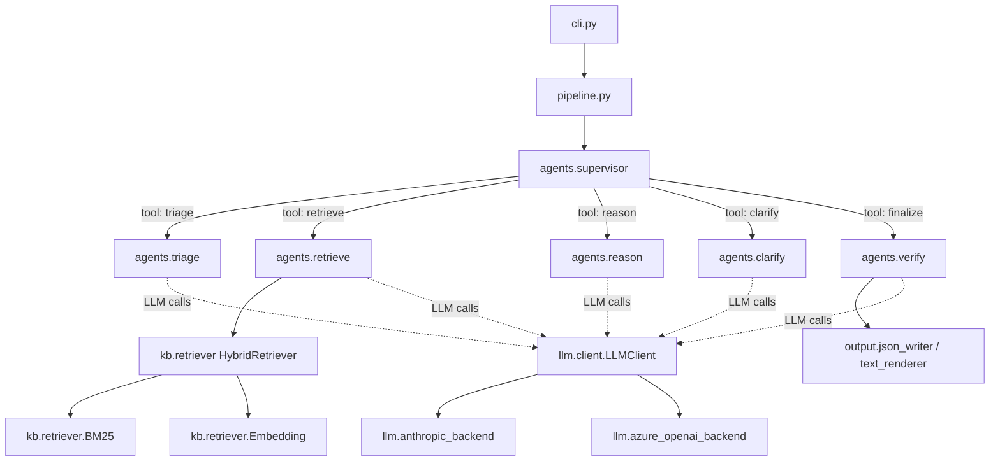

# 5. Building Block View

## High-level structure

The system is a single Python package, `wscad_triage`, organised into orthogonal subpackages.

The diagram is updated when the supervisor's tool set changes (every time a new worker agent is added).

## Building blocks

| Block | Responsibility | Lives in |
|-------|----------------|----------|
| `cli` | Click entry point; loads tickets, runs the pipeline, writes output. | [`src/wscad_triage/cli.py`](../../src/wscad_triage/cli.py) |
| `pipeline` | Builds and compiles the LangGraph state graph; runs a single ticket end-to-end. | `src/wscad_triage/pipeline.py` (Phase 3) |
| `agents.supervisor` | LLM agent with tool definitions for each worker; decides the next action each turn. | `src/wscad_triage/agents/supervisor.py` (Phase 3) |
| `agents.triage` | Initial classification + metadata-completeness assessment. | `src/wscad_triage/agents/triage.py` (Phase 3) |
| `agents.retrieve` | Wraps `HybridRetriever`; reformulates ticket text into a retrieval query. | `src/wscad_triage/agents/retrieve.py` (Phase 3) |
| `agents.reason` | Drafts the proposed solution; produces a claim-to-evidence map. | `src/wscad_triage/agents/reason.py` (Phase 3) |
| `agents.clarify` | Generates 2–4 targeted follow-up questions tied to detected gaps. | `src/wscad_triage/agents/clarify.py` (Phase 3) |
| `agents.verify` | Groundedness safety gate; per-claim verdict + 0–1 grounding score. | `src/wscad_triage/agents/verify.py` (Phase 3) |
| `kb.loader` | Loads `.md` files, parses YAML frontmatter, returns `RawDoc` objects. | `src/wscad_triage/kb/loader.py` (Phase 1) |
| `kb.chunker` | Sentence-level chunking with provenance metadata. | `src/wscad_triage/kb/chunker.py` (Phase 1) |
| `kb.retriever` | `BM25` (sparse), `Embedding` (multilingual MiniLM with on-disk cache), and `HybridRetriever` (RRF, Phase 1 / issue #12). All three implement `retrieve(query, k) -> list[RetrievalResult]`. | `src/wscad_triage/kb/retriever.py` (Phase 1) |
| `llm.client` | Provider-agnostic LLM interface; deterministic mock for tests. | `src/wscad_triage/llm/client.py` (Phase 3) |
| `llm.anthropic_backend` | Anthropic SDK adapter with prompt caching for KB context. | `src/wscad_triage/llm/anthropic_backend.py` (Phase 3) |
| `llm.azure_openai_backend` | Azure OpenAI adapter (production target). | `src/wscad_triage/llm/azure_openai_backend.py` (Phase 3) |
| `confidence` | Rubric formula + verifier integration; `compute_confidence(state)`. | `src/wscad_triage/confidence.py` (Phase 4) |
| `output.json_writer` | Serialises the canonical `Output` model. | `src/wscad_triage/output/json_writer.py` (Phase 4) |
| `output.text_renderer` | Renders the JSON to the human-readable Sample_Output.txt-style text. | `src/wscad_triage/output/text_renderer.py` (Phase 4) |
| `observability` | Structured JSON logging with per-ticket trace IDs. | `src/wscad_triage/observability.py` (Phase 3) |
| `eval.runner` / `eval.metrics` | Evaluation harness over the labeled ticket set. | [`eval/`](../../eval/) (Phase 5) |

The package boundaries are deliberately narrow: each subpackage exposes a small, typed surface area; cross-subpackage imports go through that surface area only.
